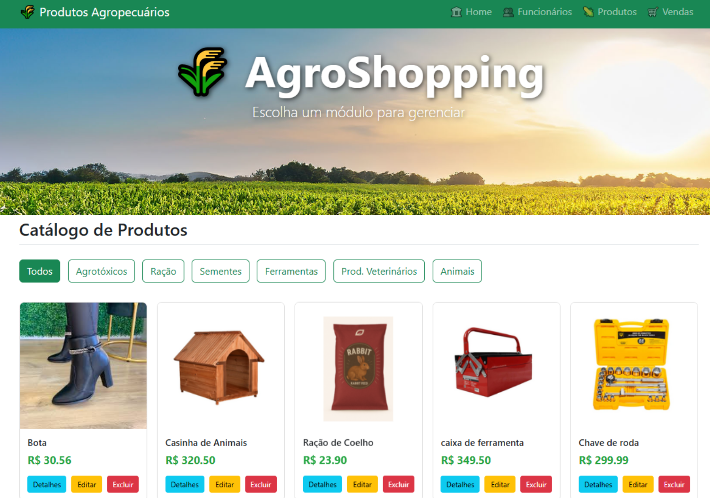

# 🌾 Sistema de Gestão "AgroShopping"

Uma aplicação web completa desenvolvida com o framework Laravel para a gestão de uma loja de produtos agropecuários. O sistema permite o controle de funcionários, catálogo de produtos com imagens categorizados ou não por nicho, e um ponto de venda para registrar transações de forma eficiente.

## 🚀 Funcionalidades Principais

O sistema é dividido em três módulos principais e um dashboard inicial:

#### **Dashboard (Página Inicial)**
- Página de boas-vindas visualmente atraente com uma imagem de fundo temática.
- Apresenta o nome do sistema e serve como ponto de partida para os outros módulos, acessíveis pelo menu de navegação.

#### **Módulo de Funcionários**
- **CRUD completo** (Criar, Ler, Atualizar, Excluir) para o cadastro de funcionários (vendedores).
- Os dados são gerenciados em uma única página com formulário e tabela, utilizando **AJAX** para evitar recarregamentos e proporcionar uma experiência de uso fluida.
- Os funcionários cadastrados são usados para identificar o vendedor em cada transação de venda.

#### **Módulo de Produtos**
- **CRUD completo** para o gerenciamento de produtos.
- **Catálogo Visual em Grade:** Exibição dos produtos em formato de "cards", similar a um e-commerce, com imagem, nome e preço.
- **Upload de Imagens:** O sistema permite o upload de uma imagem para cada produto, que é armazenada de forma segura e exibida no catálogo.
- **Filtro por Categoria:** Funcionalidade de filtragem dinâmica que permite ao usuário visualizar produtos por tipos específicos (Ração, Sementes, Ferramentas, etc.).
- **Modal de Detalhes:** Cada produto possui um botão "Detalhes" que abre uma janela pop-up (modal) com a imagem ampliada, descrição e preço, para uma consulta rápida.

#### **Módulo de Vendas**
- **Formulário de Venda Dinâmico:** Interface para registrar novas vendas, permitindo adicionar múltiplos produtos a uma única transação.
- **Cálculo de Total em Tempo Real:** O valor total da venda é calculado e exibido instantaneamente na tela conforme os produtos e quantidades são alterados.
- **Geração de Nota Fiscal:** Ao salvar a venda, o sistema gera e exibe uma nota fiscal/recibo na tela com todos os detalhes da transação (funcionário, data, itens, preços e total), pronta para impressão.

## 💻 Tecnologias Utilizadas

- **Backend:**
  - **PHP 8+**
  - **Laravel 10+:** Framework robusto para a estruturação de toda a lógica de negócio, rotas e interação com o banco de dados.
  - **Eloquent ORM:** Para manipulação dos dados de forma elegante e segura.

- **Frontend:**
  - **HTML5 & CSS3**
  - **Bootstrap 5:** Para a criação de um layout responsivo e componentes visuais modernos.
  - **JavaScript & jQuery:** Responsáveis pela interatividade, requisições **AJAX**, cálculos em tempo real e manipulação dinâmica da interface sem recarregar a página.
  - **Blade:** Sistema de templates do Laravel para a renderização das views.

- **Banco de Dados:**
  - **MySQL:** Sistema de gerenciamento de banco de dados relacional para armazenamento de todos os dados da aplicação.

- **Ambiente de Desenvolvimento:**
  - **XAMPP** para o servidor Apache.
  - **Composer:** Para gerenciamento de dependências do PHP.

## ⚙️ Instalação e Configuração

Para executar este projeto localmente, siga os passos abaixo:

1. **Instale as dependências do Composer:**
    composer install

3.  **Configure o arquivo de ambiente:**
    - Copie o arquivo de exemplo: `cp .env.example .env`
    - Gere uma chave de aplicação: `php artisan key:generate`

4.  **Crie e configure o banco de dados:**
    - Crie um banco de dados para o projeto.
    - No arquivo `.env`, atualize as seguintes variáveis com os dados do seu banco:
      ```
      DB_CONNECTION=mysql
      DB_HOST=127.0.0.1
      DB_PORT=3306
      DB_DATABASE=nome_do_seu_banco
      DB_USERNAME=seu_usuario_mysql
      DB_PASSWORD=sua_senha_mysql
      ```

5.  **Execute as migrações do banco de dados:**
    php artisan migrate

7.  **Inicie o servidor de desenvolvimento:**
    php artisan serve

8.  **Acesse a aplicação no seu navegador:** `http://localhost:8000`

## 📌 Autor

Desenvolvido por **Jamilly**.


